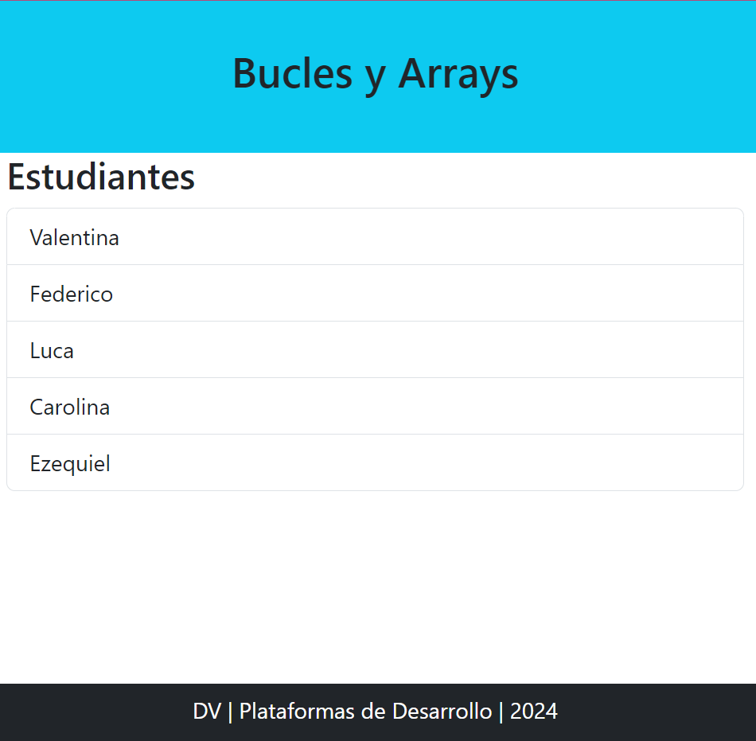

# 🎯 Temas de la clase
- PHP y HTML
- Condicionales
- Bucles
- Arrays

## Bucle for
``` php
    $estudiantes = ['Valentina', 'Federico', 'Luca', 'Carolina', 'Ezequiel'];
    for($i=0; $i< 5; $i++){
        $persona = $estudiantes[$i];
        echo("<li class='list-group-item'> $persona</li>");

    }
```


